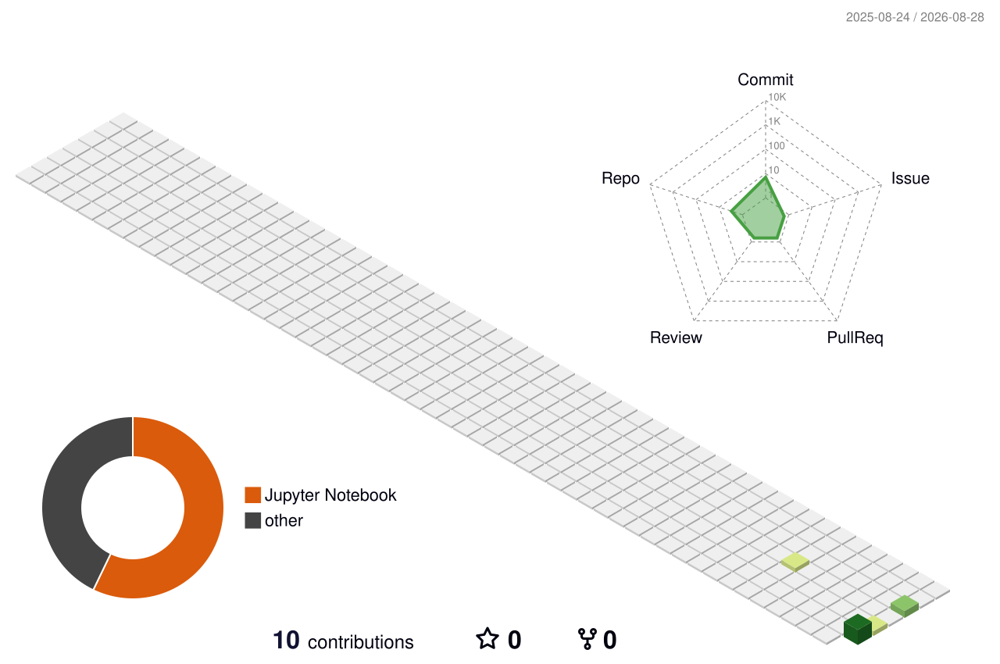

<h1 align="center">Hi! I'm Juliette 👋</h1>

  

### 🚀 About me

Hi, I'm Juliette 👋 Engineer working across data, AI, backend and cloud.

🔭 &nbsp;I'm currently working on **designing and building an end-to-end personal data and AI project**  
🌱 &nbsp;I'm currently learning **Databricks**, and deepening my AI/ML skills  
👯 &nbsp;I'm looking to collaborate on **projects that make a real difference in everyday life. Not tech for tech's sake.** <!--The kind of work my family, friends, and people around me would relate to-->
⚡ &nbsp;Fun fact: I'm a big fan of escape games and board games — I approach tech problems the same way

### 🛠️ Tech stack

**Most proficient**

  
  
  

**Currently exploring**

  

**Also studied or worked with**

_Data & AI_

  
  
  
  
  
  
  
  
  
  
  
  
  
  
  
  
  
  
  

_Software Development_

  
  
  
  
  
  
  
  
  
  
  
  
  
  

_Tools & Infra_

  
  
  
  
  
  
  
  
  
  
  
  
  
  
  
  
  
  
  
  

### 🏙️ Skyline

  

